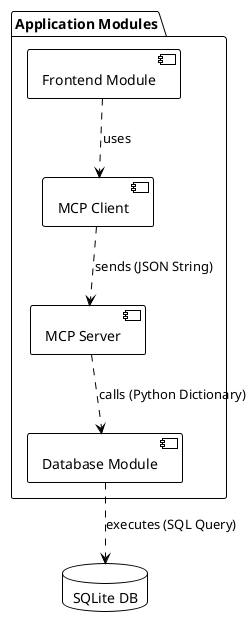
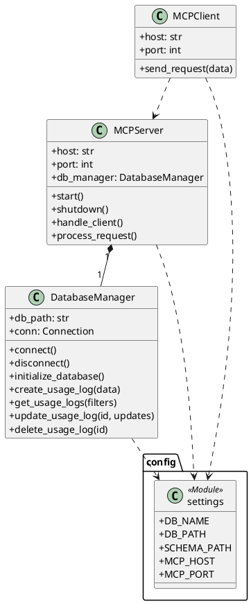
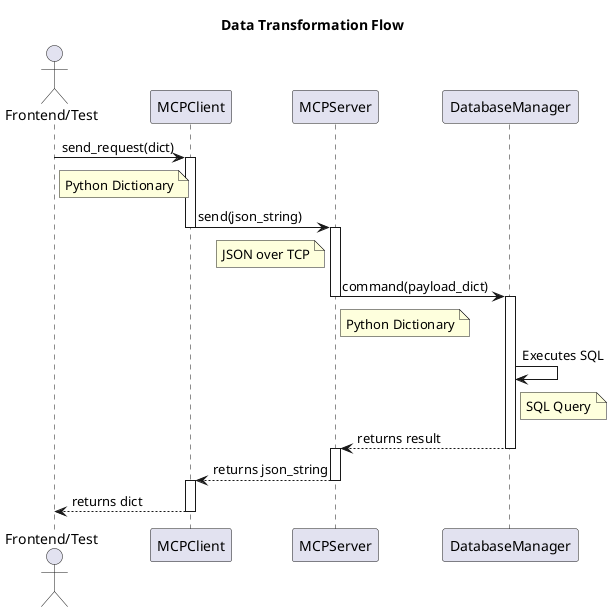

# Modular Application Usage MCP System

This project is a modular, message-oriented system for logging and retrieving application usage data. It is composed of three core, decoupled modules: a database manager, an MCP (Model Context Protocol) messaging layer, and a future-proof structure for adding frontends.

## Architecture

The system is designed with loose coupling and high cohesion in mind. Each module operates independently and communicates only through the MCP layer. This makes the system scalable, testable, and easy to maintain.

### Architectural Benefits (MCP vs. Monolithic)

This section explains the trade-offs of using the MCP architecture for this project compared to a traditional, monolithic design.

#### Monolithic Approach (Without MCP)

In a monolithic design, a frontend would directly import and call the `DatabaseManager`.

*   **Advantages**:
    *   **Simplicity**: Fewer moving parts and less initial setup for a very small project.
*   **Disadvantages**:
    *   **Tight Coupling**: The frontend is directly dependent on the database logic. Any change to the `DatabaseManager` class could require changes to the frontend.
    *   **Poor Scalability**: It is difficult to add new, independent services (e.g., a notification service) or distribute components across different machines.
    *   **Difficult to Test**: The frontend and database logic cannot be easily tested in isolation.
    *   **Technology Lock-in**: The frontend must be written in a language compatible with the backend (e.g., both in Python).

#### Modular Approach (With MCP)

In our current architecture, modules communicate via standardized JSON messages, with no direct dependencies.

*   **Advantages**:
    *   **Loose Coupling**: Modules are completely independent. The database can be swapped (e.g., from SQLite to PostgreSQL) with zero changes to any other module.
    *   **High Scalability**: New modules can be added easily. They just need to connect to the MCP server and handle specific messages.
    *   **Improved Testability**: Each module can be tested independently.
    *   **Language Agnostic**: A new frontend could be written in any language (e.g., JavaScript, C#) as long as it can send JSON over a TCP socket.
*   **Disadvantages**:
    *   **Increased Complexity**: More initial setup and boilerplate code are required.
    *   **Overhead**: A small performance overhead exists due to network communication and JSON processing compared to a direct in-process function call.

### Component Responsibilities and Data Flow

This section details the role of each component in processing a request.

#### Block Diagram



#### Step-by-Step Data Flow

1.  **Frontend Module (The Initiator)**
    *   The process begins in a client module (e.g., a future web frontend or the current test scripts).
    *   It constructs a standard Python dictionary representing the desired action (e.g., `{'module': 'database', 'command': 'create_usage_log', ...}`).
    *   It passes this dictionary to an instance of the `MCPClient`.

2.  **MCP Client (The Messenger)**
    *   **Responsibility**: To handle the mechanics of communication.
    *   It takes the Python dictionary.
    *   It serializes the dictionary into a JSON formatted string.
    *   It opens a TCP network connection to the `MCPServer`.
    *   It sends the JSON string over the network and waits for a response.

3.  **MCP Server (The Router)**
    *   **Responsibility**: To listen for requests and delegate tasks.
    *   It receives the JSON string from the network connection.
    *   It deserializes the JSON back into a Python dictionary.
    *   It inspects the `module` and `command` keys to understand the request.
    *   It calls the appropriate method on its internal instance of the `DatabaseManager`, passing the `payload` dictionary.

4.  **Database Module (The Worker)**
    *   **Responsibility**: To execute the core business logic.
    *   It receives a simple Python dictionary from the `MCPServer`. It has no knowledge of the network, JSON, or where the request came from.
    *   It performs the requested database operation (e.g., constructs and executes an SQL `INSERT` statement).
    *   It returns a simple Python object (like a `list` or `int`) to the `MCPServer`.

5.  **The Response Journey**
    *   The `MCPServer` takes the return value from the `DatabaseManager`, wraps it in a response dictionary, and sends it back to the `MCPClient` as a JSON string.
    *   The `MCPClient` receives the JSON response, deserializes it into a Python dictionary, and returns it to the original caller (the Frontend Module).

### Class Diagram



### Sequence Diagram



## Project Structure

```
application_usage_mcp/
|-- config/
|   |-- __init__.py
|   |-- settings.py         # Centralized configuration
|-- database/
|   |-- __init__.py
|   |-- db_manager.py       # Handles all database operations
|   |-- schema.sql          # SQL schema for the database
|-- mcp/
|   |-- __init__.py
|   |-- mcp_client.py       # Client for sending requests to the server
|   |-- mcp_server.py       # Core message-passing server
|-- tests/
|   |-- __init__.py
|   |-- test_db_manager.py  # Unit tests for the database
|   |-- test_mcp_integration.py # End-to-end integration test
|-- .gitignore              # Git ignore file
|-- main.py                 # Main entry point to start the server
|-- README.md               # This file
```

## Setup and Usage

### 1. Prerequisites
- Python 3.10+

### 2. Installation
No external libraries are required for the core modules.

### 3. Configuration
All settings can be modified in `config/settings.py`.

### 4. Running the Application

**Start the Server:**
Open a terminal and run:
```bash
python main.py
```
The server will start and listen on the host and port defined in the configuration.

### 5. Running Tests

**Run all tests:**
To ensure the system is working correctly, run the test suite from the project root directory:
```bash
python -m unittest discover tests
```
This command will automatically discover and run all unit and integration tests.
